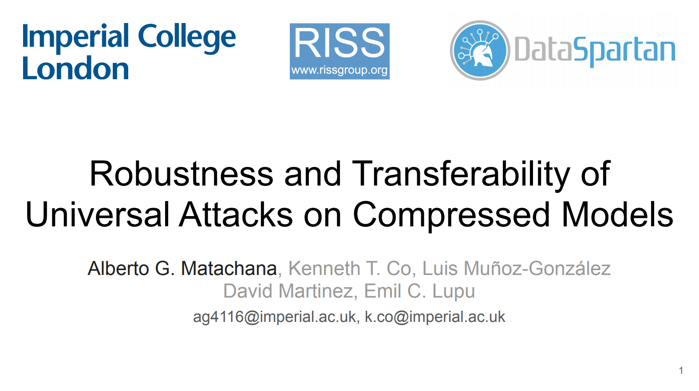

# UAPs on Compressed Models

This repository contains sample code and interactive Jupyter notebooks for the paper:
* ["Robustness and Transferability of Universal Attacks on Compressed Models"](https://arxiv.org/abs/2012.06024) (AAAI'21 Workshop)

In this work, we present an empirical evaluation on the robustness
and attack transferability for machine learning models compressed through pruning and quantization. We analyze
whether the vulnerabilities of the original full precision
model remain, change, or worsen after pruning or quantizing the model. We study the differences between the UAP
robustness of the compression methods and discuss their
transferability as well as vulnerability to targeted UAPs.

This project is licensed under the MIT License, see the [LICENSE.md](LICENSE.md) file for details.